# Vorobei Anastasiia | IPZ-23-1

# NotesApp - Система управління нотатками

## Опис програми

NotesApp - це веб-додаток для управління персональними нотатками з підтримкою:
- Створення/редагування/видалення нотаток
- Додавання тегів до нотаток
- Нагадувань
- Історії змін
- Аутентифікації користувачів
- Управління профілем

## Процес запуску локально

1. Встановіть .NET 6 SDK та SQLite
2. Клонуйте репозиторій
3. Виконайте команди:
dotnet restore
dotnet build
dotnet run
4. Відкрийте http://localhost:5000 у браузері

## Programming Principles

1. **SOLID**:
- Single Responsibility: Кожен контролер відповідає за одну область
- Open/Closed: Розширення через наслідування IdentityUser
- Liskov Substitution: Використання базових класів (Controller, IdentityUser)
- Interface Segregation: Розділені інтерфейси Identity
- Dependency Injection: Всі залежності ін'єктуються через конструктори

2. **DRY** (Don't Repeat Yourself) - повторно використовувані компоненти (_Layout.cshtml, _ValidationScriptsPartial)

3. **KISS** (Keep It Simple) - проста архітектура без зайвих шаблонів

4. **YAGNI** (You Aren't Gonna Need It) - реалізовано лише необхідний функціонал

5. **Separation of Concerns** - чітке розділення на моделі, представлення, контролери

## Design Patterns

1. **MVC (Model-View-Controller)**
Повноцінна реалізація шаблону MVC:
- Контролери: NotesController.cs, AccountController.cs
- Моделі: Note.cs, Tag.cs
- Представлення: Views/Home/Index.cshtml

2. **Repository**:
- `ApplicationDbContext` виступає як репозиторій для роботи з даними

public async Task<IActionResult> Index()
{
    var notes = await _context.Notes
        .Include(n => n.NoteTags)
        .ThenInclude(nt => nt.Tag)
        .ToListAsync();
    return View(notes);
}

3. **Observer**:
- Система нагадувань у `Home/Index.cshtml`

setInterval(checkReminders, 60000);

4. **Factory Method**:
- Створення моделей через фабричні методи у контролерах
- Наприклад: `new Note { Title = model.Title, ... }`

## Refactoring Techniques

1. **Extract Method**: винесення логіки запису історії в окремий метод
- Метод `RecordHistory` у `NotesController.cs`
- Метод `togglePasswordVisibility` у скриптах

2. **Inline Method**:
- Прості методи, що використовуються лише один раз

3. **Replace Temp with Query**:
- Заміна тимчасових змінних на LINQ-запити
- Наприклад: `var tags = await _context.Tags.ToListAsync()`

4. **Introduce Parameter Object**:
- Використання ViewModels (`ChangePasswordViewModel`, `RegisterViewModel`)

5. **Replace Conditional with Polymorphism**:
- Обробка різних типів подій у історії через `switch` у `GetBadgeClass`

6. **Move Method**:
- Логіка роботи з тегами винесена в окремий `TagController`

7. **Consolidate Conditional Expression**:
- Об'єднання умов у методах перевірки доступу

## Вигляд

Головна сторінка додатку. Користувач не може перейти на будь-яку іншу сторінку, окрім реєстрації чи входу.

---

### Вхід

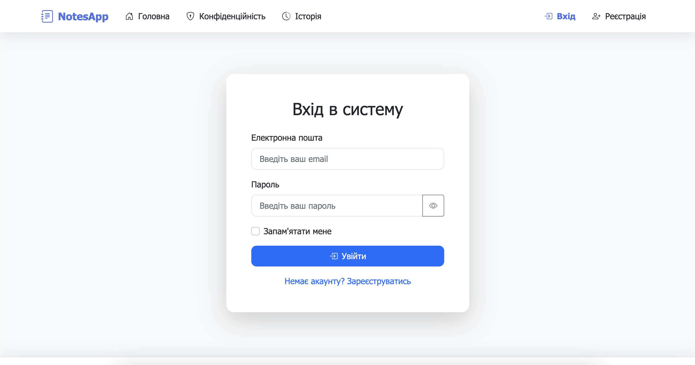  
*Форма входу користувача в додаток.*

---

### Реєстрація

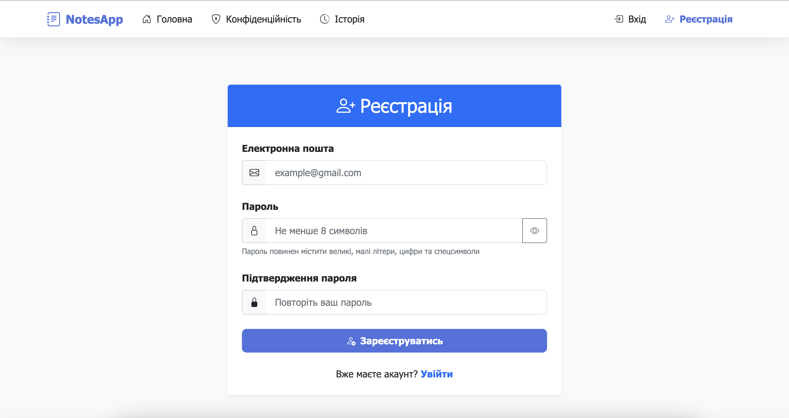  
*Сторінка реєстрації нового користувача. Всі помилки при вводі паролю, відображаються під відповідним полем для зручності користувача.*

---

### Головна сторінка

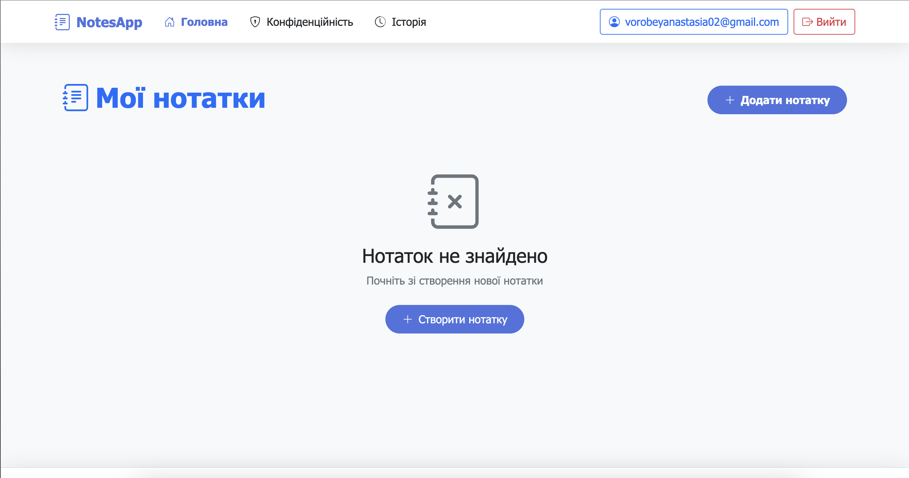  
*Порожня головна сторінка після успішного входу, без створених нотаток.*

---

### Створення нотатки

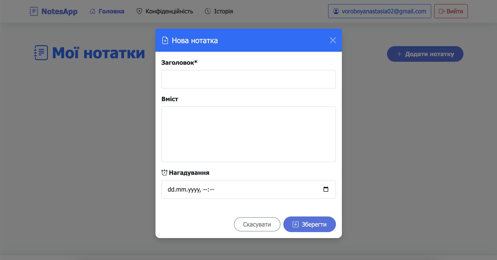  
*Інтерфейс для створення нової нотатки.*

---

### Нотатка

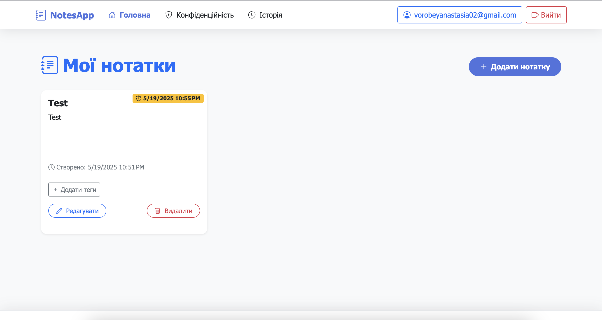  
*Перегляд створеної нотатки на головній сторінці.*

---

### Додавання тегу до нотатки

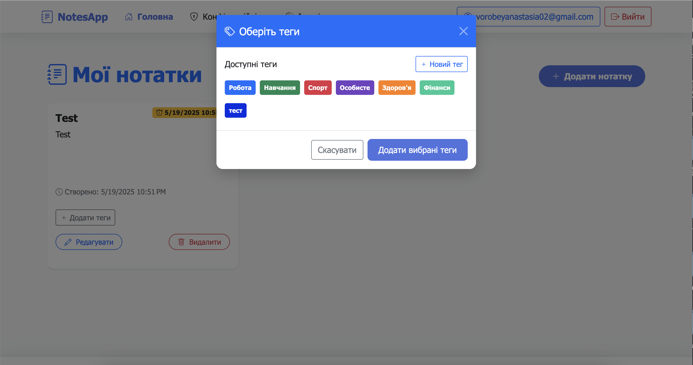  
*Процес додавання тега до нотатки.*

---

### Створення власного тегу

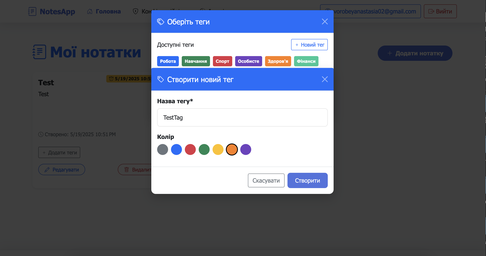  
*Форма для створення нового користувацького тегу.*

---

### Нотатка з тегом

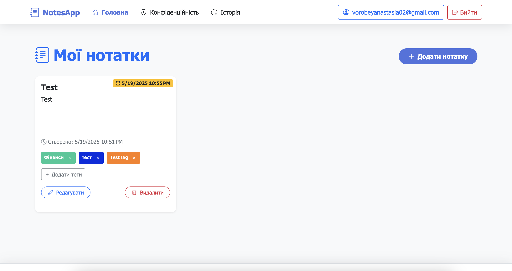  
*Нотатка, позначена доданим тегом.*

---

### Сповіщення

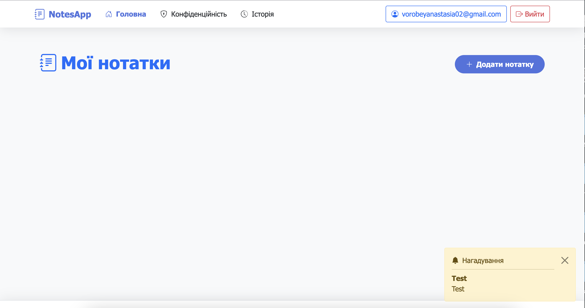  
*Приклад відображення сповіщення.*

---

### Профіль користувача

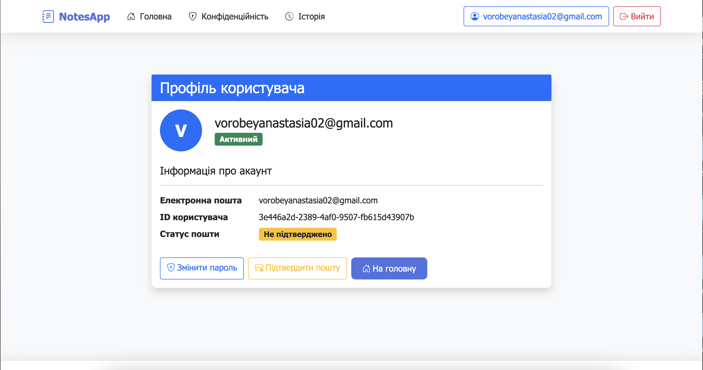  
*Сторінка профілю користувача з інформацією про акаунт.*

---

### Зміна пароля

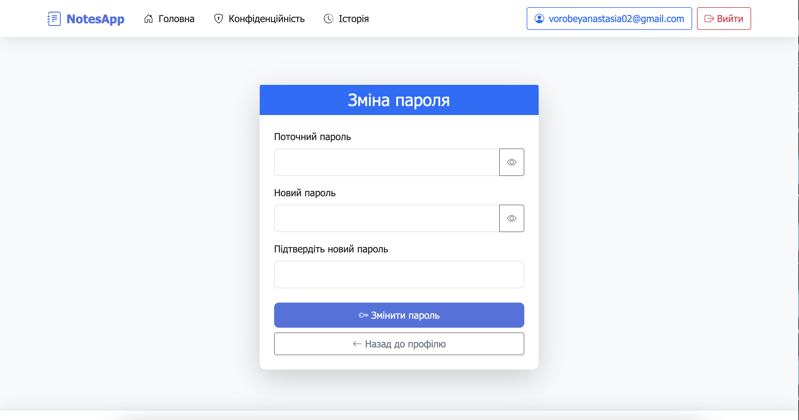  
*Форма для зміни пароля користувача.*

---

### Успішно змінений пароль

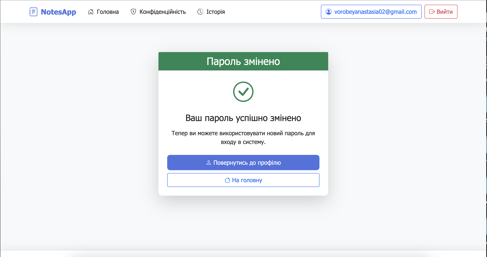  
*Повідомлення про успішну зміну пароля.*

---

### Історія нотаток

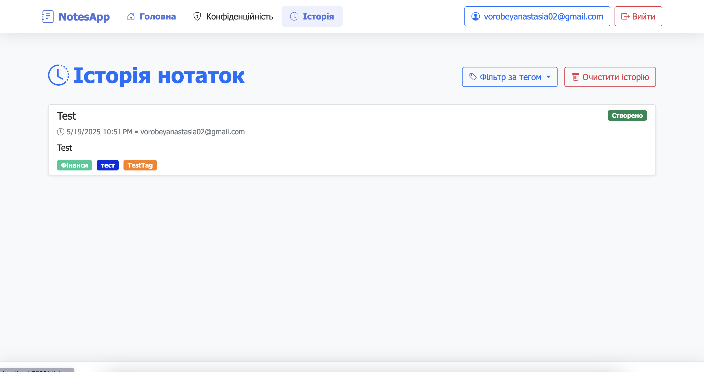  
*Журнал змін і історія нотаток.*

---

### Фільтрація історії за тегами

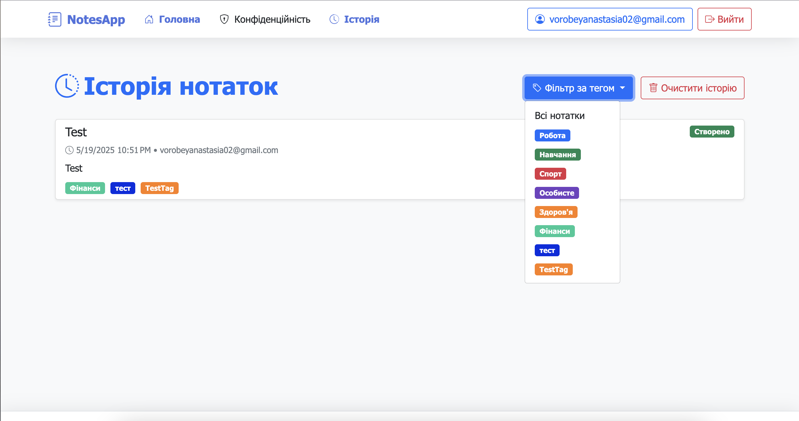  
*Можливість фільтрувати історію нотаток за тегами.*

---

### Кількість рядків в коді

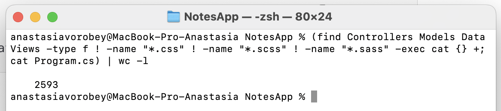  